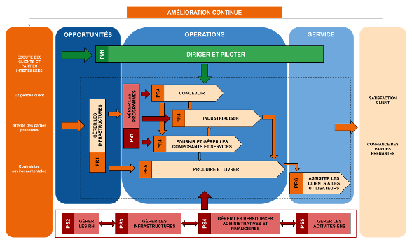
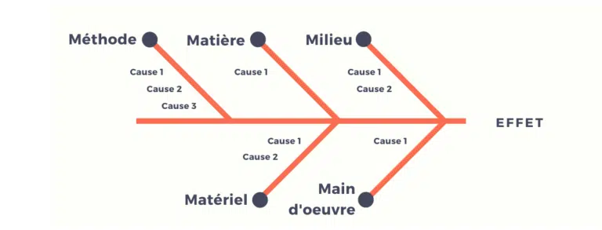

 # 25 12 19

Glossaire Mot clé important :

Parties Prenantes.

Intéligence économique (IE)

DBKM

Exigence

Cartogtaphie des procéssus :

Veille -> IE -> Exigences -> REX

***diagramme-ishikawa***

<centre>

</centre>

